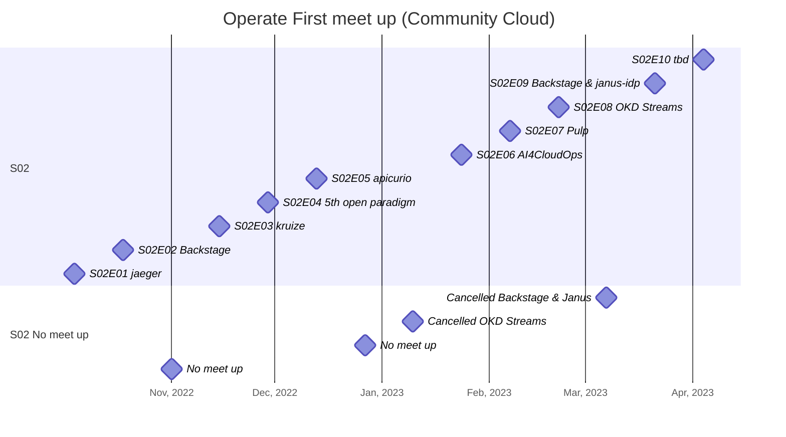
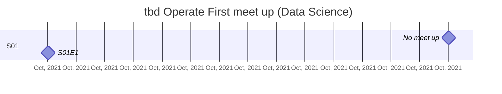

# Operate First Community Cloud fortnightly meet up

[op1.st/meetup](https://op1.st/meetup)

- Sign up for the [mailing list](https://op1.st/mailinglist).
- Check our community [calendar](https://op1.st/meetup-calendar).
- Join our meetup every other Tuesday @ 11:00 ET on [google meet](https://op1.st/meetup-gmeet).
- Introduce yourself on [slack](https://op1.st/slack) in the [#general](https://operatefirst.slack.com/archives/C01RF4SPNDD) or [#data-science channel](https://operatefirst.slack.com/archives/C02KY881CJE).
- Present or suggest a topic by creating an [issue here](https://op1.st/mailinglist).
- Check out our [GitHub repos](https://op1.st/github).
- Watch previous sessions on [YouTube](https://op1.st/youtube)!
- [Twitter](https://op1.st/twitter), [Mastodon](https://op1.st/mastodon)

# Season 02 (S02)

## S02 Upcoming
### Tue tbd 2023-04-04
#### S02E10 tbd

## S02 Held
### Tue 2023-03-21
#### S02E09 Backstage & janus-idp [link](https://janus-idp.io)
### Tue 2023-03-07
#### Cancelled (Backstage / Janus)
### Tue 2023-02-21
#### S02E08 OKD Streams (CentOS Stream CoreOS) [link](https://www.okd.io/blog/2022-10-25-OKD-Streams-Building-the-Next-Generation-of-OKD-together/)
### Tue 2023-02-07
#### S02E07 Pulp [link](https://pulpproject.org/)
### Tue 2023-01-24
#### S02E06 AI4CloudOps
### Tue 2023-01-10
#### Cancelled
### Tue 2022-12-27
#### No meet up
### Tue 2022-12-13
#### S02E05 apicurio [link](https://www.apicur.io/)
### Tue 2022-11-29
#### S02E04 The 5th open paradigm
### Tue 2022-11-15
#### S02E03 kruize / kruize HPO
### Tue 2022-11-01
#### No meet up
### Tue 2022-10-18
#### S02E02 Backstage
### Tue 2022-10-04
#### S02E01 jaeger

# Season 01 (S01)

